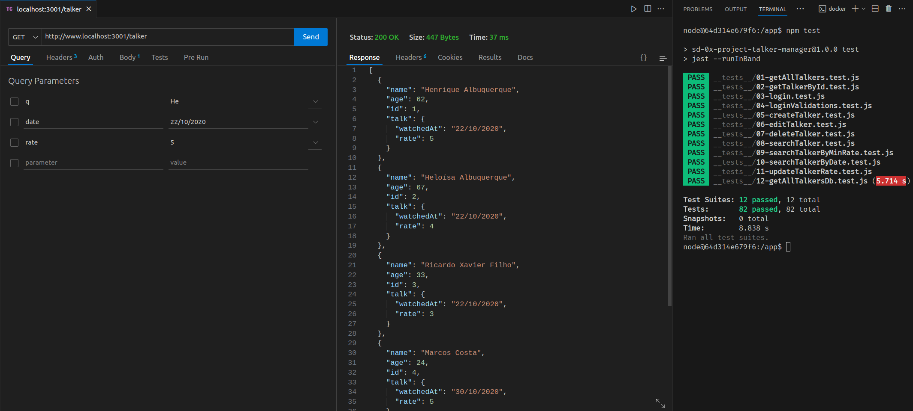

# README: Talk Manager



## Project Description

This is a Speaker application that enables CRUD (Create, Read, Update, Delete) operations. Most functions retrieve data from JSON, but the last one performs a query in a MySQL database. This project includes middleware validations and has been organized into a few folders: db for the database logic, routes for the routes, and middlewares for the validations.

### Technologies

- LINUX
- VSCODE
- NODE.JS
- MYSQL
- JAVASCRIPT

### What I Learned

- How to retrieve information from MySQL or JSON files
- How to validate input data in headers, body and queries
- How to configure a backend application
- How to separate logic from routes

## How to Run the Project

1. Clone the repository:

   ```bash
   git clone https://github.com/feduarte-dev/talk-manager
   ```

2. Navigate to the project directory:

   ```bash
   cd your-repository
   ```

3. Install dependencies:

   ```bash
   npm install
   ```

4. Initiate the containers

   ```bash
   docker-compose up -d
   docker exec -it talker_manager bash
   npm start
   ```

5. If you want to run tests, run another terminal

   ```bash
   docker exec -it talker_manager bash
   npm run lint
   npm test
   ```

## Contributions

[Felipe](https://www.linkedin.com/in/feduarte-dev/) - /db - /middlewares - /routes - /utils


[Trybe](https://www.betrybe.com/) - Everything else
